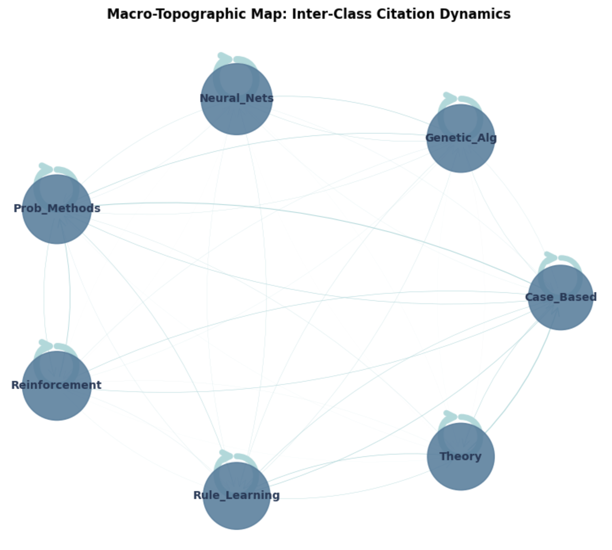
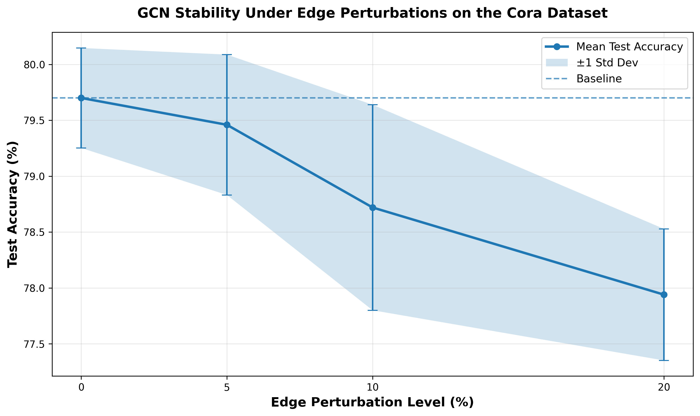
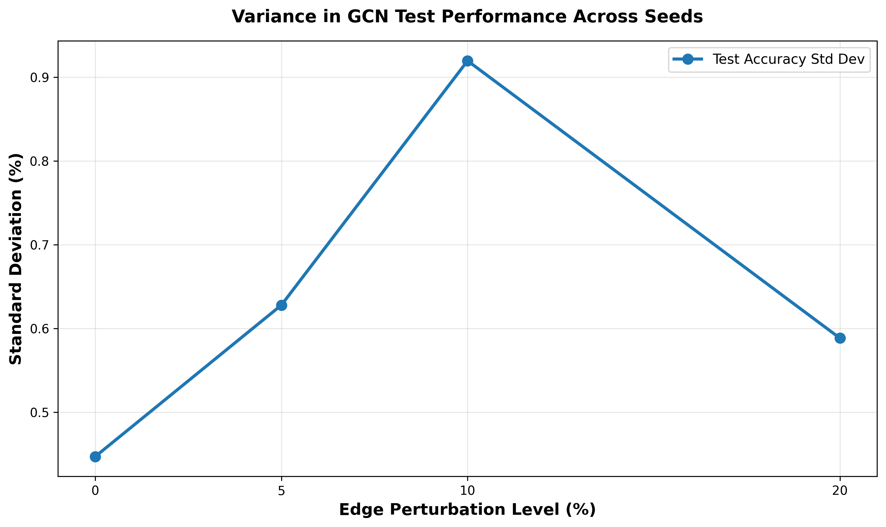
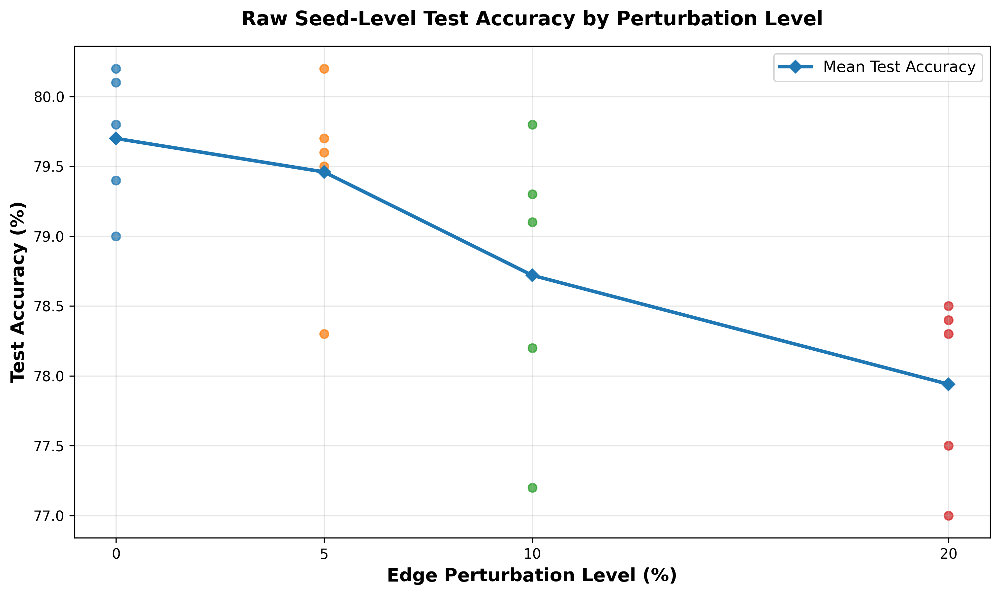
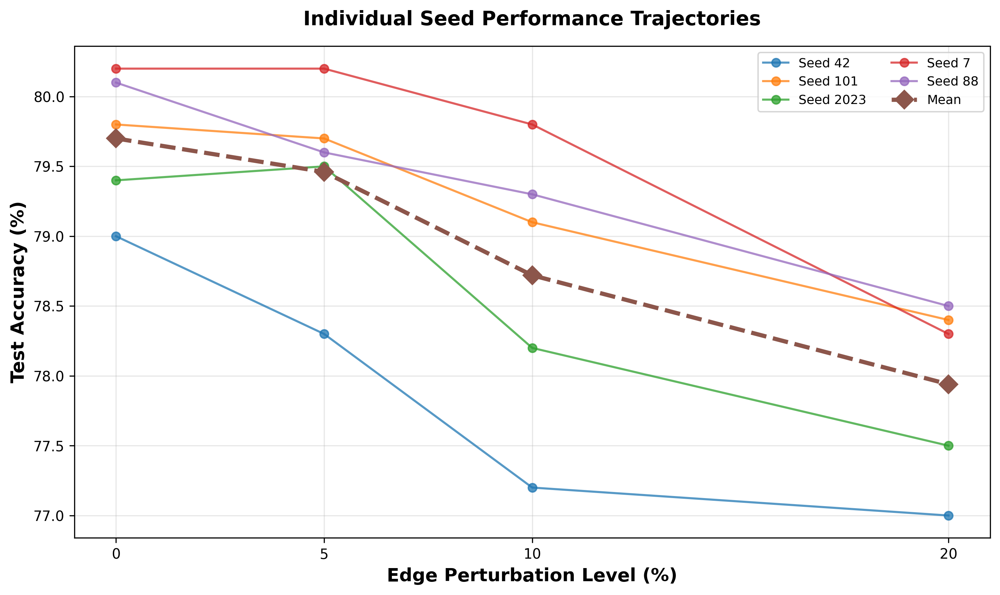

# Graph Neural Network (GNN) Structural Stability Analysis  
### Scientific Machine Learning (SciML) Sandbox | ASU STP 499 Research Track

This repository documents an early-stage research sandbox exploring how Graph Convolutional Network (GCN) performance on the Cora citation network changes under random edge deletion perturbations. This is a brainstorming-level experiment to establish baseline observations before pursuing deeper theoretical analysis involving spectral stability, Lipschitz continuity, and Banach fixed-point theory.

## 🌐 Network Topology & Information Flow

Before evaluating adversarial noise or random edge erasure, we project the entire Cora dataset—consisting of 2,708 academic papers and 10,556 citation links—into a condensed, macro-topographic map to analyze how information flows across distinct research fields.

<p align="center">
  
  <br>
  <em>Figure 1: Macro-Topographic Map of Inter-Class Citation Dynamics across the Cora Dataset.</em>
</p>

### Asset Description & Structural Mapping
* **Subject Bubble Scaling:** The physical area of each class node (e.g., *Neural Networks*, *Genetic Algorithms*) is programmatically scaled based on its diagonal intra-class homophily value. Larger bubbles indicate tighter thematic clustering.
* **Directional Arrow Widths:** The thickness of the connecting arcs represents the empirical probability of cross-disciplinary citations (the off-diagonal transition elements) between different academic domains.

### Strategic Interpretation & Robustness Connection
This macro-map exposes the structural mechanics behind **Community Boundary Bleeding**. While the prominent self-loops demonstrate that feature aggregation is heavily concentrated inside homophilous class boundaries, the thin web of inter-class arrows represents active channels of cross-disciplinary communication. 

When a network experiences edge drops, dominant intra-class edges are stripped away first due to pure random distribution. As these internal clusters collapse, the relative proportion of cross-class noise flowing along the off-diagonal links increases. During spatial convolutions, node embeddings begin to drift out of alignment and bleed across semantic boundaries—forcing vanilla Graph Convolutional Networks (GCNs) into a non-linear accuracy drop down to **$77.94\%$**.

## Current Results Summary

The baseline experiment tracks GCN test accuracy across 5 independent random seeds (42, 101, 2023, 7, 88) at four edge deletion levels:

| Perturbation Level | Mean Test Accuracy | Std Dev | Absolute Drop | Relative Drop |
|---:|---:|---:|---:|---:|
| 0% | 79.70% | ±0.45% | 0.00% | 0.00% |
| 5% | 79.46% | ±0.63% | -0.24% | -0.30% |
| 10% | 78.72% | ±0.92% | -0.98% | -1.23% |
| 20% | 77.94% | ±0.59% | -1.76% | -2.21% |

**Interpretation:**  
The baseline GCN achieves 79.70% test accuracy with no edge deletion. At 20% edge deletion, accuracy drops to 77.94%, an absolute decrease of 1.76 percentage points and a relative decrease of about 2.21%. The largest standard deviation appears at 10% perturbation, suggesting that the model may be more sensitive to which specific edges are removed at that level. These results support an early observation that GCN performance depends on graph structure, but the decline is moderate in this first experiment.


## Generated Figures

The analysis notebook produces four visualizations saved to `results/figures/`:


*Mean test accuracy vs. edge deletion percentage with error bars.*


*Standard deviation across perturbation levels.*


*Individual seed performance at each perturbation level.*


*Trajectory of each seed across perturbation levels.*


## Current Notebook

`notebooks/01_baseline_analysis.ipynb` contains the first cleaned analysis notebook. It loads the current JSON results from `results/local_stability_metrics.json`, creates the summary table, generates four figures, and documents the current interpretation.

## Current Limitations

- Only one dataset: Cora
- Only one model: GCN
- Only edge deletion perturbation (no feature noise, no adversarial attacks)
- Only five random seeds
- No validation accuracy logged yet
- No training accuracy logged yet
- No statistical significance testing yet
- No spectral or Lipschitz analysis yet

## Next Steps

- Add validation and training accuracy logging
- Add more seeds for stronger statistical confidence
- Add finer perturbation levels such as 2.5%, 7.5%, and 15%
- Add statistical testing in a future `02_statistical_analysis.ipynb`
- Later compare GCN with GAT, GraphSAGE, and SGC
- Later explore spectral stability and Lipschitz or Banach fixed-point connections
- Later test on additional datasets such as CiteSeer and PubMed

## Future Mathematical Direction

The current experiment manipulates the spatial convolution operator at layer $l+1$:

$$H^{(l+1)} = \sigma \left( \tilde{D}^{-\frac{1}{2}} \tilde{A} \tilde{D}^{-\frac{1}{2}} H^{(l)} W^{(l)} \right)$$

By programmatically deleting target edge percentages from the coordinate tensor (`edge_index`), we alter the perturbed adjacency matrix $\tilde{A}$, which shifts the spectrum of the normalized graph Laplacian:

$$L_{\text{sym}} = I - \tilde{D}^{-\frac{1}{2}} \tilde{A} \tilde{D}^{-\frac{1}{2}}$$

Future theoretical work may investigate whether this perturbation disrupts the Laplacian's low-pass filtering properties, and whether Lipschitz continuity bounds or Banach fixed-point theory can provide formal stability guarantees. These are promising directions for deeper mathematical analysis once the empirical baseline is more thoroughly established.
## Quickstart

1. Ensure you have `mamba` installed. If not, visit https://mamba.readthedocs.io/en/latest/installation.html.
2. Activate the conda environment:

```bash
mamba activate local_gnn_env
```

3. Run the stability test Python script:

```bash
python local_stability_test.py
```

This generates `results/local_stability_metrics.json` with mean accuracy, standard deviation, and raw scores for each perturbation level.

4. Open and run the analysis notebook:

```bash
jupyter notebook notebooks/01_baseline_analysis.ipynb
```

Run **Kernel → Restart & Run All** to regenerate the summary table and figures. Figures are saved to `results/figures/`.

---

Contributions and usage questions welcome. This environment has been tested on local machines equipped with PyTorch Geometric.

---

*Last updated: May 2026*
